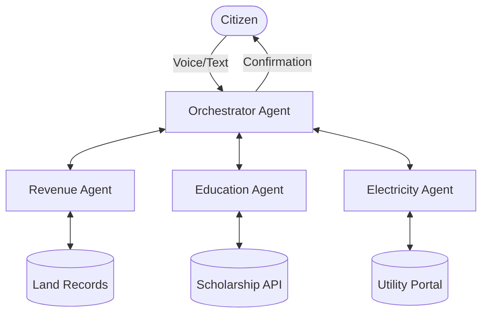

# Presentation: Jana-Sevanam - Kerala's Agent of Agents Program

## Slide 1: The Vision
**Empowering every citizen with an AI Assistant.**
- **Problem**: Complex government procedures, language barriers, and fragmented department portals.
- **Solution**: A unified, voice-first "Agent of Agents" (Orchestrator) that speaks the citizen's language and handles inter-departmental tasks.

---

## Slide 2: How It Works (The Orchestrator)
- **Voice Interface**: Citizens speak naturally (e.g., "I need a scholarship for my daughter").
- **Smart Routing**: The Orchestrator identifies this as an 'Education' request but checks 'Revenue' for income certificates.
- **Unified Identity**: Integrated with DigiLocker and Aadhar for seamless authentication.

---

## Slide 3: Multi-Agent Collaboration

---

## Slide 4: Key Benefits
1.  **Language Inclusion**: Supports 22+ official languages and local dialects.
2.  **24/7 Availability**: Instant guidance without physical visits.
3.  **Proactive Assistance**: Notifies citizens of eligible schemes automatically.
4.  **End-to-End Execution**: Actually submits forms and pays bills, doesn't just provide links.

---

## Slide 5: Implementation Roadmap
- **Phase 1 (Month 1-3)**: Pilot with Revenue and Electricity departments.
- **Phase 2 (Month 4-6)**: Citizen feedback loop and language model fine-tuning.
- **Phase 3 (Month 7-12)**: Full-scale state-wide rollout of 20+ departments.

---

## Slide 6: Demo Simulation
*Next, we will show a functional prototype demonstrating a complex query involving multiple departments.*
